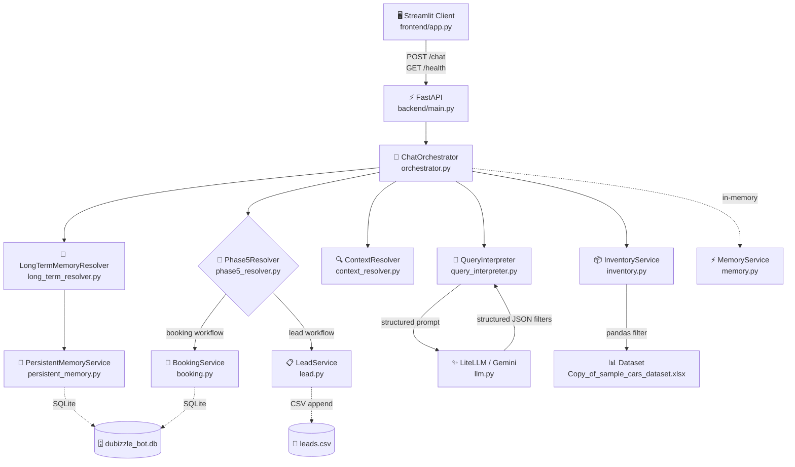
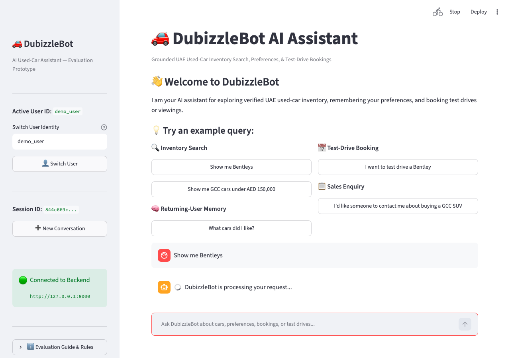
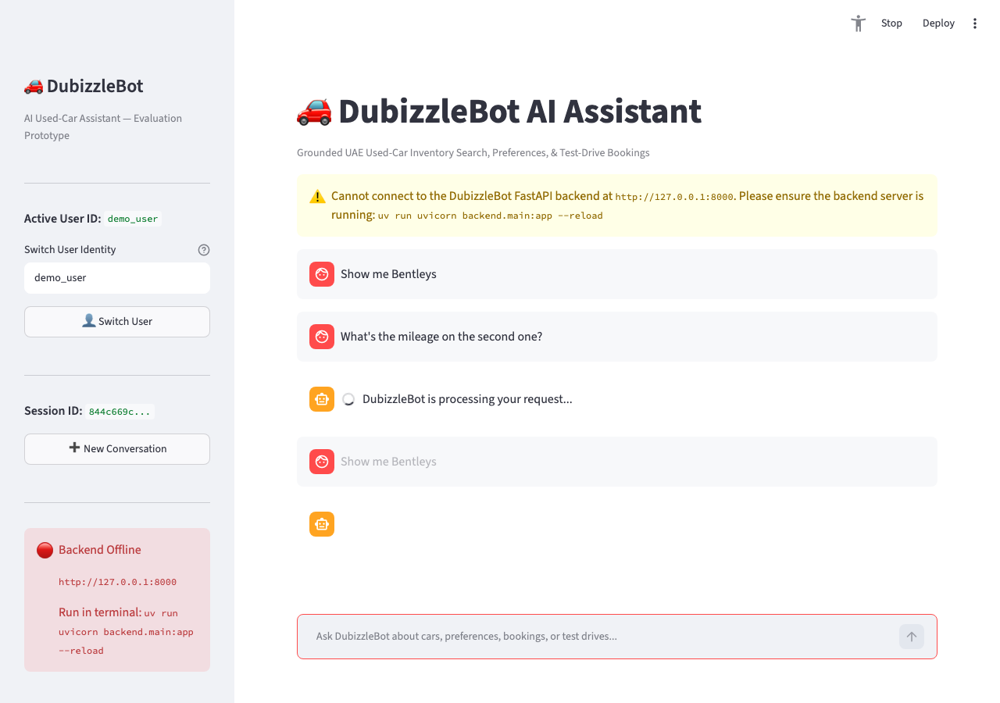
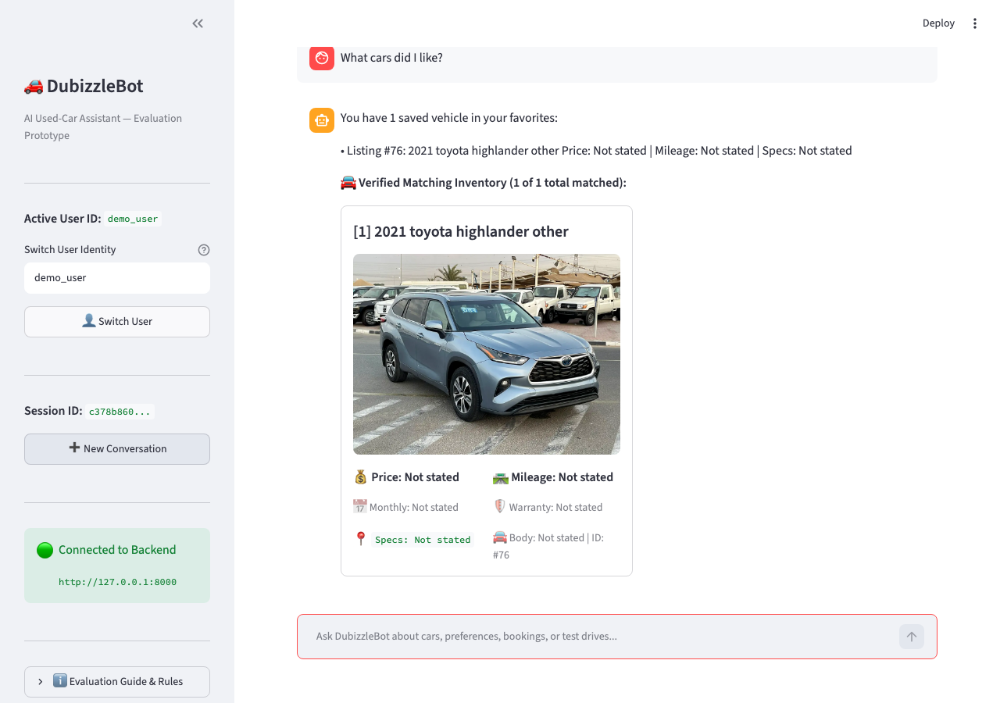

# DubizzleBot — AI-Grounded Used-Car Assistant

> **Take-Home Prototype** — This is an assessment project demonstrating a conversational AI assistant for dubizzle cars. It is not an official Dubizzle production service.

DubizzleBot lets users explore a UAE used-car inventory through natural language, save favourites across sessions, book test-drive viewings, and submit lead enquiries — all grounded in a real deterministic inventory rather than LLM-generated answers.

**Key design principle:** The LLM interprets natural language and extracts structured filters. Deterministic Python services handle every inventory lookup, business-rule decision, and persistence operation. The LLM never selects listing IDs or invents vehicle facts.

---

## Key Capabilities

- **Natural-language search** — "Show me Bentleys", "GCC spec under AED 150,000 from 2018"
- **Structured filter extraction** — make, model, year range, price, mileage, regional specs, warranty, keywords
- **Deterministic grounded retrieval** — exact pandas DataFrame matching; every returned listing is real
- **Clarification instead of guessing** — vague queries ("cheap car") ask for specifics, never fabricate thresholds
- **Transparent unsupported constraints** — "cheapest" / "lowest mileage" reported as unsupported, not silently applied
- **Contextual references** — "the second one", "it", "that car" resolved from the active result set
- **Persistent favourites** — saved across sessions and process restarts via SQLite
- **Returning-user recognition** — same `user_id`, new conversation → previous preferences recalled
- **Test-drive booking** — Mon–Sat, 08:00–20:00 Asia/Dubai, with explicit confirmation and stable reference
- **Lead qualification** — budget + contact + automotive need + explicit confirmation → CSV persistence
- **Non-automotive guardrails** — out-of-scope requests politely redirected
- **Streamlit UI** — grounded vehicle cards, global ordinal numbering, persistent identity sidebar

---

## Architecture



**Gemini returns structured JSON filters — it never selects Listing IDs or invents vehicle facts. `InventoryService` makes all retrieval decisions deterministically.**

---

## Requirement → Implementation Mapping

| Assessment Requirement | DubizzleBot Implementation |
|---|---|
| FastAPI backend | `backend/main.py` — `GET /health`, `POST /chat`, `POST /inventory/search`, `GET /inventory/summary` |
| Streamlit client | `frontend/app.py` — pure HTTP client, no backend imports |
| LiteLLM + Gemini | `backend/services/llm.py` — `gemini/gemini-3.6-flash` via LiteLLM |
| Natural-language search | `QueryInterpreter` (NLP) + `InventoryService` (deterministic filter) |
| Grounded retrieval | `InventoryService.search()` — pandas DataFrame; LLM never touches results |
| Short-term memory | `MemoryService` + `ContextResolver` — ordinal references within session |
| Returning-user memory | `PersistentMemoryService` (SQLite) + `LongTermMemoryResolver` |
| Test-drive / viewing | `BookingService` + `Phase5Resolver` — Mon–Sat 08:00–20:00 Asia/Dubai |
| Lead qualification | `LeadService` + `Phase5Resolver` — budget + contact + need + confirmation |
| Non-automotive guardrails | `ChatOrchestrator` intent layer — `unknown` → polite redirect |
| Persistent storage | SQLite (`dubizzle_bot.db`) + local CSV (`leads.csv`) |
| 192 offline tests | `tests/` — 12 test modules, zero Gemini/network dependency |

---

## Quick Start

### Prerequisites

- Python ≥ 3.10
- [`uv`](https://github.com/astral-sh/uv) — `pip install uv` or see [docs](https://docs.astral.sh/uv/getting-started/installation/)
- A [Google AI Studio](https://aistudio.google.com/) API key (free tier available)

### Setup

```bash
# 1. Clone
git clone https://github.com/Sedulous-sedu/DubizzleBot.git
cd DubizzleBot

# 2. Create your local environment file (never committed)
cp .env.example .env
# Open .env and set: GEMINI_API_KEY=<your key>

# 3. Install all dependencies
uv sync --frozen --extra dev

# 4. Start the backend  (terminal 1)
uv run uvicorn backend.main:app --reload --port 8000

# 5. Start the frontend  (terminal 2)
uv run streamlit run frontend/app.py
# → Open http://localhost:8501 in your browser

# 6. Run the test suite  (offline — no API key needed)
uv run pytest
```

### Environment Variables

| Variable | Purpose | Default |
|---|---|---|
| `GEMINI_API_KEY` | Google AI Studio key — **required for live chat** | *(none)* |
| `LLM_MODEL` | LiteLLM model identifier | `gemini/gemini-3.6-flash` |
| `LLM_TEMPERATURE` | Sampling temperature (0.0 = deterministic) | `0.0` |
| `LLM_TIMEOUT_SECONDS` | LLM call timeout (seconds) | `30.0` |
| `BACKEND_HOST` | Uvicorn bind host | `0.0.0.0` |
| `BACKEND_PORT` | Uvicorn bind port | `8000` |
| `DATABASE_URL` | SQLite path for bookings + persistent memory | `sqlite:///./dubizzle_bot.db` |
| `LEADS_CSV_PATH` | CSV file for qualified lead records | `leads.csv` |
| `BOOKING_TIMEZONE` | Timezone for business-hours validation | `Asia/Dubai` |
| `BACKEND_URL` | URL Streamlit uses to reach FastAPI | `http://127.0.0.1:8000` |

`GEMINI_API_KEY` is **not** required for `uv run pytest` — all LLM paths are mocked in the offline test suite.

---

## API Reference

Auto-generated interactive docs are available at **`http://localhost:8000/docs`** when the backend is running.

### `GET /health`

Returns backend status.

```json
{"status": "ok", "project": "DubizzleBot API", "version": "0.1.0"}
```

### `POST /chat`

Main conversational endpoint. Send a natural-language message; receive a grounded response.

**Request:**
```json
{
  "user_id": "demo_user",
  "session_id": "550e8400-e29b-41d4-a716-446655440000",
  "message": "Show me Bentleys"
}
```

`session_id` is optional on first turn; a UUID will be generated and echoed back.

**Response fields:**

| Field | Type | Description |
|---|---|---|
| `user_id` | string | Echoed user identifier |
| `session_id` | string | Conversation session UUID |
| `response` | string | Grounded natural-language reply |
| `matched_cars` | array \| null | Exact matching `CarListing` objects (full list, not capped) |
| `intent` | string | Classified intent (`inventory_search`, `viewing_or_lead_request`, `general_chat`, `unknown`) |
| `total_matches` | integer | Count of matching vehicles |
| `requires_clarification` | boolean | True if input was too vague to search |

### `POST /inventory/search`

Direct deterministic inventory filter (bypasses LLM). Accepts a `CarFilter` body.

### `GET /inventory/summary`

Returns aggregate statistics for the loaded dataset (total listings, make distribution, year range, spec counts, warranty counts).

---

## Evaluator Demo Walkthrough

A 3–5 minute sequence that exercises all key capabilities:

| Step | What to type | What to expect |
|---|---|---|
| **1. Search** | `Show me Bentleys` | 7 grounded vehicles, ordinals **[1]**–**[7]** |
| **2. Context** | `What's the mileage on the second one?` | **318 km**, Listing #17 |
| **3. Persistent memory** | `I like the second one` → click **➕ New Conversation** → `What cars did I like?` | Listing #17 recalled across sessions |
| **4. Booking** | `Show me Bentleys` → `I want to test drive the second one <future Saturday> at 3 PM` → `Confirm` | Confirmation with `#BK-XXXXXX` reference |
| **5. Lead** | `I'd like someone to contact me about buying a GCC SUV` → provide budget + phone → `Yes, submit` | Confirmation with `#LEAD-XXXXXX` reference |
| **6. Guardrail** | `Write me Python code` | Polite automotive redirect |

> **Step 4 date:** Use any upcoming Monday–Saturday. Example: *"I want to test drive the second one next Saturday at 3 PM"*

---

## Demo & Visual Evidence

Below is visual evidence captured directly from the Streamlit client talking to the live FastAPI backend with Gemini API integration.

### Core Evaluation Evidence

1. **Multi-Turn Grounded Search & Contextual Follow-Up**
   - **Step 1:** Natural-language search extracting make filter (`make="Bentley"`).  
     
   - **Step 2:** In-session ordinal reference resolution ("the second one" → Listing #17, 318 km).  
     

2. **Cross-Session Returning-User Memory (New Conversation)**
   - **Step 3:** Favourites saved to SQLite persist after clicking **➕ New Conversation** (new `session_id`), recalled instantly for `demo_user`.  
     

### Additional Visual Captures & Transcripts

- 📅 **Test-Drive Booking**: [`04_test_drive_booking.png`](docs/screenshots/04_test_drive_booking.png) — Mon–Sat 08:00–20:00 Asia/Dubai validation & `#BK-XXXXXX` reference.
- 📋 **Lead Qualification**: [`05_lead_qualification.png`](docs/screenshots/05_lead_qualification.png) — Contact + budget + automotive need + confirmation CSV append with `#LEAD-XXXXXX` reference.
- 🛡️ **Non-Automotive Guardrail**: [`06_out_of_scope_guardrail.png`](docs/screenshots/06_out_of_scope_guardrail.png) — Polite redirect for out-of-scope prompts.

📄 **Full Sanitized Text Transcripts:**
- [`docs/demo/multi_turn_inventory.md`](docs/demo/multi_turn_inventory.md) — Step-by-step multi-turn search & ordinal reference log.
- [`docs/demo/returning_user_memory.md`](docs/demo/returning_user_memory.md) — Cross-session SQLite memory & booking log.

---

## How Grounding Works

DubizzleBot intentionally separates LLM responsibilities from inventory decisions:

### LLM role (`QueryInterpreter` → `llm.py`)

- Classifies user intent (`inventory_search`, `viewing_or_lead_request`, `general_chat`, `unknown`)
- Extracts structured constraints from natural language into a `ParsedInventoryQuery`:
  - `make`, `model`, `min_year`, `max_year`
  - `min_price_aed`, `max_price_aed`
  - `min_mileage_km`, `max_mileage_km`
  - `regional_specs`, `warranty`, `keywords`, `limit`
- Sets `requires_clarification=true` for vague queries
- Reports unsupported constraints (e.g., "cheapest", "best deals") transparently

### Deterministic service role (`InventoryService`)

- Applies extracted filters to the pandas DataFrame
- Returns exact `CarListing` objects with real `listing_id` values from the dataset
- The LLM **never** touches the results, never selects a listing ID, and never fabricates vehicle facts

**Example:**
```
User: "Show me Land Rovers from 2018 under AED 150,000"

Gemini  → {"make": "Land Rover", "min_year": 2018, "max_price_aed": 150000.0}

InventoryService → DataFrame[make == "Land Rover" & year >= 2018 & price_aed <= 150000]
                → Returns verified CarListing objects from dataset
```

---

## Retrieval & Data Design

**Why structured retrieval instead of a vector database:**

- The dataset contains ~100 listings — small enough that exact filtering is reliable, fast, and fully auditable
- Most user constraints are enumerable attributes (make, year, price, mileage, regional spec, warranty) better served by precise matching than semantic similarity
- Deterministic filtering eliminates hallucination risk for structured facts
- Keyword matching (`keywords` field) handles semi-structured attributes found in listing titles and descriptions (trim levels, colours, packages, equipment)

**Dataset extraction:** The provided dataset contains both structured columns and useful facts embedded in listing `title` and `description` fields. `InventoryService` uses conservative regex extraction to derive:
- Cash price
- Monthly payment
- Mileage
- Regional specs
- Warranty status
- Body type

If a fact cannot be reliably extracted, it remains `None` / "Not stated". The frontend and backend **never fabricate absent values**.

---

## Memory Architecture

### Short-Term (In-Session) — `MemoryService` + `SessionState`

- **Scope:** `user_id` + `session_id`
- **Stores:** active result set, active listing reference, pending booking/lead draft
- **ContextResolver** resolves ordinal references ("the second one", "it") to specific listings from the current result set
- **Lifetime:** cleared when a new conversation begins

```
Session A:
  User: "Show me Bentleys"         → 7 results stored in session
  User: "What's the mileage on     → ContextResolver maps "second" → index 1
         the second one?"             → Listing #17 → 318 km
```

### Long-Term (Cross-Session) — `PersistentMemoryService` → SQLite

- **Scope:** `user_id` only — survives new sessions and process restarts
- **Stores:** explicit favourites (by `listing_id`), explicit preferences, recent search (tracked separately)
- **Key invariant:** `last_search_filters ≠ explicit preference`. Only deliberate save signals ("I like this", "save this car") write to permanent preferences.
- **LongTermMemoryResolver** reads SQLite and re-hydrates saved listings from the live inventory

```
Session A:
  User: "I like the second one"    → Listing #17 saved to SQLite

User clicks ➕ New Conversation    → new session_id, chat cleared

Session B (same user_id):
  User: "What cars did I like?"    → LongTermMemoryResolver reads SQLite
                                     → Listing #17 returned from live inventory
```

---

## Booking Design

Booking availability is **simulated** per the assessment specification:

- **Days:** Monday–Saturday (Sunday excluded)
- **Hours:** 08:00–20:00 inclusive, **Asia/Dubai** timezone
- **Lead time:** Future appointments only
- **Availability:** All vehicles assumed available (no real dealership calendar integration)

**Flow:**

1. Vehicle resolved from session context or explicit mention
2. Date/time extracted from natural language
3. `BookingService` validates against business rules deterministically
4. Bot presents structured summary for explicit user confirmation
5. On confirmation: persisted to SQLite with stable `#BK-XXXXXX` reference

---

## Lead Qualification Design

**Required to qualify a lead:**

1. Contact: phone **or** email (validated format)
2. Budget or price range
3. Automotive need or vehicle interest
4. Explicit confirmation ("yes", "confirm", "submit")

**Flow:** Multi-turn draft collection via `Phase5Resolver` → `LeadService.save_lead()` → thread-safe CSV append.

**Deduplication:** `LeadService` enforces idempotency using a stable `lead_id`. On each save, it acquires a threading lock, reads existing `lead_id` values from the CSV under that lock, and skips the append if the same `lead_id` already exists. This is a process-level guarantee suitable for the single-server prototype.

**Persistence:** Append-only CSV with 13 structured columns (`lead_id`, `created_at`, `user_id`, `session_id`, `name`, `phone`, `email`, `min_budget_aed`, `max_budget_aed`, `interested_make`, `interested_model`, `interested_listing_id`, `requirements`).

---

## Streamlit Frontend Architecture

The Streamlit client is a **pure HTTP client**. It communicates with the backend exclusively via:

- `GET /health` — backend liveness check
- `POST /chat` — send message, receive grounded response

The frontend:
- Does **not** import any backend domain classes or services
- Does **not** read the Excel dataset, SQLite database, or leads CSV directly
- Does **not** know the Gemini API key
- Makes **exactly one** `POST /chat` per deliberate user submission (no automatic retries — chat is stateful)
- Validates that the returned `(user_id, session_id)` matches the request identity

**Identity model:**

| Concept | What it means |
|---|---|
| `active_user_id` | Returning-user identity — persists across New Conversation |
| `session_id` | Conversation UUID — regenerated on New Conversation |
| **➕ New Conversation** | Preserves `user_id`, new `session_id`, clears visible chat, does **not** clear persistent memory |
| **👤 Switch User** | Changes `user_id`, new `session_id`, clears visible chat, does **not** delete other users' data |

---

## Project Structure

```text
DubizzleBot/
├── pyproject.toml                       # Project definition and dependency manifest
├── .env.example                         # Environment variables template (safe to commit)
├── Copy_of_sample_cars_dataset.xlsx     # Provided UAE used-car inventory
│
├── backend/                             # FastAPI application
│   ├── main.py                          # App factory, API endpoints
│   ├── config.py                        # Settings loader (.env → Settings)
│   ├── models/                          # Pydantic schemas
│   │   ├── car.py                       # CarFilter, CarListing
│   │   ├── chat.py                      # ChatRequest, ChatResponse
│   │   ├── intent.py                    # UserIntentEnum, ParsedInventoryQuery, ParsedUserIntent
│   │   ├── memory.py                    # SessionState, ContextResolutionResult
│   │   ├── persistent_memory.py         # LongTermMemoryAction, LongTermMemoryResolution
│   │   ├── booking.py                   # BookingDraft, ConfirmedBooking, BookingStatus
│   │   └── lead.py                      # LeadDraft, QualifiedLead
│   ├── services/                        # Domain services
│   │   ├── llm.py                       # LiteLLM + Gemini API integration
│   │   ├── query_interpreter.py         # NLP intent + filter extraction
│   │   ├── inventory.py                 # Pandas-based deterministic inventory search
│   │   ├── memory.py                    # In-session short-term MemoryService
│   │   ├── context_resolver.py          # Ordinal/pronoun reference resolution
│   │   ├── persistent_memory.py         # Cross-session SQLite PersistentMemoryService
│   │   ├── long_term_resolver.py        # Favourite/preference recall across sessions
│   │   ├── booking.py                   # Business-hours validation + SQLite booking
│   │   ├── lead.py                      # Lead qualification + thread-safe CSV persistence
│   │   ├── phase5_resolver.py           # Booking/lead workflow routing
│   │   ├── response_builder.py          # Grounded prose response generation
│   │   └── orchestrator.py             # Central ChatOrchestrator
│   └── database/
│       ├── connection.py                # SQLite connection management
│       └── models.py                    # DDL schema initialisation
│
├── frontend/                            # Streamlit client (pure HTTP)
│   ├── app.py                           # Streamlit UI entry point
│   ├── api_client.py                    # HTTP client with identity validation
│   ├── components.py                    # Vehicle card renderers and formatters
│   ├── state.py                         # Session-state transition helpers
│   └── config.py                        # Frontend configuration (BACKEND_URL)
│
├── tests/                               # Pytest offline test suite (192 tests)
│   ├── conftest.py                      # Fixtures and test app factory
│   ├── test_api.py                      # HTTP endpoint contracts (12)
│   ├── test_inventory.py                # Filter engine (22)
│   ├── test_llm_interpreter.py          # Intent + extraction (21)
│   ├── test_chat_orchestrator.py        # Orchestration flows (28)
│   ├── test_memory.py                   # Short-term session state (16)
│   ├── test_persistent_memory.py        # SQLite cross-session persistence (29)
│   ├── test_booking.py                  # Business hours, idempotency (23)
│   ├── test_lead.py                     # Qualification, CSV, dedup (13)
│   ├── test_frontend_client.py          # API client, identity validation (12)
│   ├── test_frontend_state.py           # State transitions (8)
│   ├── test_frontend_components.py      # Formatters, warranty truthfulness (6)
│   └── test_frontend_app.py             # AppTest smoke tests (2)
│
├── scripts/                             # Verification scripts (not run in CI)
│   ├── smoke_test_chat_e2e.py
│   ├── smoke_test_frontend_e2e.py
│   ├── smoke_test_interpreter.py
│   ├── smoke_test_memory_e2e.py
│   ├── smoke_test_persistent_memory_e2e.py
│   ├── smoke_test_phase5_e2e.py
│   └── verify_streamlit_apptest.py
│
└── docs/
    ├── screenshots/                     # Annotated browser captures
    └── demo/                            # Sanitized conversation transcripts
```

---

## Testing

### 192 Offline Tests

All tests run without Gemini API access. LLM paths are covered by injected mock interpreters.

```bash
uv run pytest
# 192 passed, 1 warning
```

| Module | Tests | What it covers |
|---|---|---|
| `test_inventory.py` | 22 | Filter engine, exact matching, edge cases |
| `test_llm_interpreter.py` | 21 | Intent classification, filter extraction, injection resistance |
| `test_chat_orchestrator.py` | 28 | Full orchestration, context override, memory routing |
| `test_persistent_memory.py` | 29 | SQLite persistence, favourites, preferences, cross-session recall |
| `test_booking.py` | 23 | Business hours, timezone, idempotency, SQLite persistence |
| `test_lead.py` | 13 | Qualification rules, CSV persistence, deduplication |
| `test_memory.py` | 16 | Short-term session state management |
| `test_api.py` | 12 | HTTP endpoint contracts and response schemas |
| `test_frontend_client.py` | 12 | API client, identity validation, zero-retry invariant |
| `test_frontend_state.py` | 8 | State transitions (new conversation, switch user) |
| `test_frontend_components.py` | 6 | Field formatters, warranty truthfulness, fallbacks |
| `test_frontend_app.py` | 2 | AppTest smoke (startup, offline indicator) |

### CI

GitHub Actions (`python-app.yml`) runs on every push to `main`:

```yaml
- uv sync --frozen --extra dev
- uv run pytest
```

No Gemini API key or network access is required for CI to pass.

---

## Design Decisions & Trade-offs

| Decision | Rationale | Trade-off |
|---|---|---|
| **Deterministic inventory retrieval** | Eliminates hallucinated vehicle facts; every returned listing is real and auditable | LLM cannot rank/sort results; unsupported constraints are reported transparently |
| **Structured extraction over vector DB** | ~100 listings; constraints are enumerable; exact filtering is simpler and more auditable at this scale | Would require hybrid semantic retrieval for inventory of millions of listings |
| **In-memory session + SQLite persistent identity** | Clean separation: ephemeral short-term state vs. durable long-term identity | SQLite is single-node; not suitable for multi-region without replication |
| **CSV for qualified leads** | Assessment explicitly required local CSV persistence | CSV is not transactional; suitable for single-server prototype only |
| **Pure HTTP Streamlit client** | Clean API boundary; frontend needs no backend secrets | Slight per-request network overhead vs. in-process call |
| **No automatic POST retry** | `POST /chat` is stateful; a retry could duplicate a booking or lead submission | User must re-submit deliberately on transient failure |

---

## Limitations

- **No authentication:** `user_id` is a plain string, not a verified identity
- **Static inventory:** Provided Excel file only; no live listing sync
- **Simulated booking availability:** No real dealership calendar; all vehicles assumed available
- **SQLite / CSV:** Appropriate for a single-server prototype; not production-scale persistence
- **Date/time parsing:** Handles practical expressions ("next Saturday", "3 PM") but not every possible phrasing
- **External images:** Vehicle photos depend on remote URLs; broken images show a clean fallback icon
- **No ranking model:** Cannot sort by cheapest/newest deterministically; such constraints are reported as unsupported

---

## Future Scope

- **Live inventory integration** — real-time listing feed from a database or CMS
- **Authenticated users** — OAuth 2.0 / JWT for verified returning-user identity
- **CRM integration** — route qualified leads to a real sales pipeline
- **Dealership scheduling API** — replace simulated availability with real calendar slots
- **Hybrid semantic retrieval** — embeddings + structured filter for much larger inventories
- **Observability** — structured logging, metrics, distributed tracing
- **Production persistence** — PostgreSQL + Redis session store
- **Containerisation** — Docker Compose for repeatable backend + frontend deployment
- **Richer recommendation layer** — collaborative filtering or preference-based ranking
